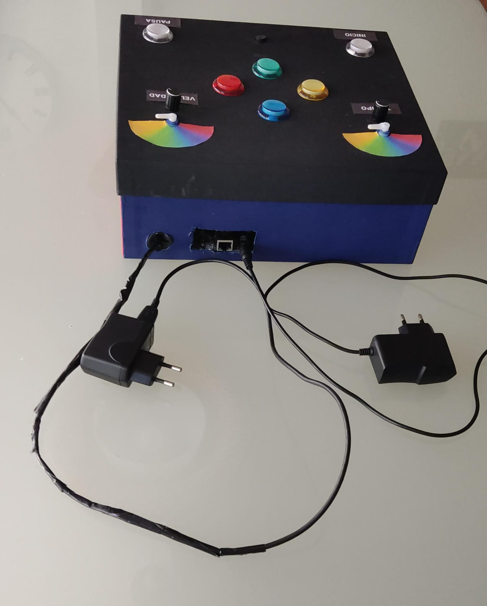
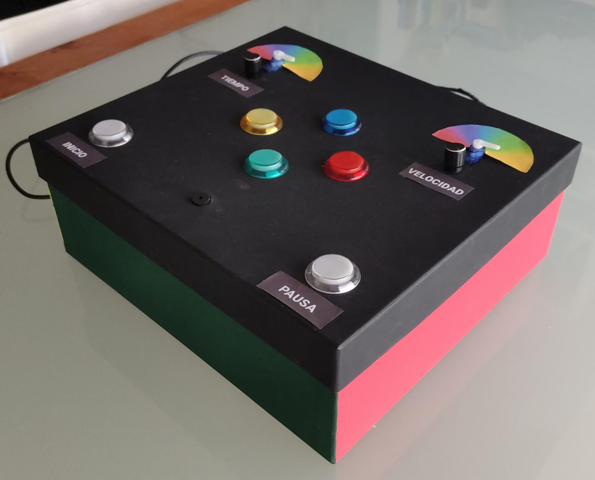
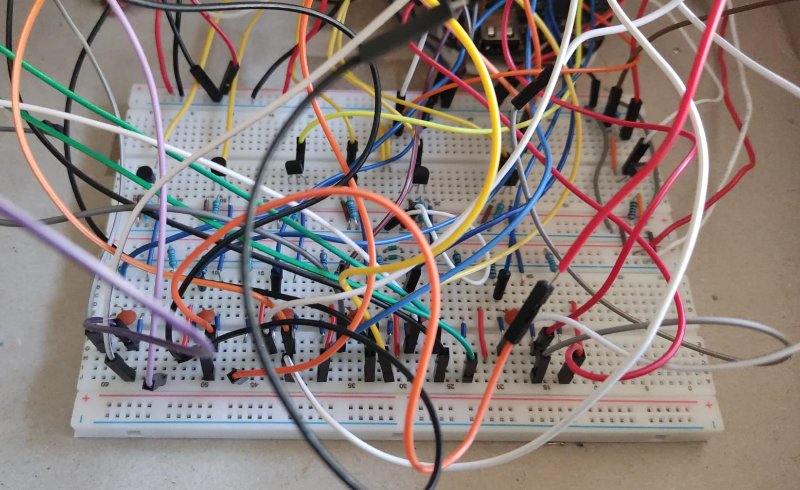

# Implementación del Juego Simón en un Entorno de Sistemas Empotrados

Este repositorio contiene el material generado durante el diseño del juego Simón en un microprocesador BeagleBone Black (BBB), desarrollado en la asignatura Interfaces Físicos y Sistemas Empotrados del Máster Universitario en Automática e Informática Industrial (MUAII).

## Recursos del proyecto
| Sección                    | Descripción                        |
|----------------------------|------------------------------------|
| [Código](Codigo/Simon_game_def/src)      | Código del proyecto |
| [Imagenes del proyecto](doc/)      | Presentación del Proyecto Final |

## Descripción general
El proyecto es el juego clásico Simon haciendo uso de una BeagleBone Black. Se usan seis botones
arcade con LED para los colores y funciones START/PAUSA, un zumbador para los tonos, y dos
diales para ajustar velocidad y tiempo de respuesta. La lógica se organiza en nueve estados (inicio,
secuencia de inicio, reproducción de la secuencia de juego, lectura de los botones, pausas, cambio
de fase y victoria), cada uno en su propio hilo, mientras interrupciones GPIO manejan los botones
de inicio y pausa. Así, el juego avanza y valida la secuencia de colores de forma concurrente y
configurable en tiempo real.

## Lista de materiales
| Componente                        | Especificaciones | Cantidad |
|-----------------------------------|------------------|----------|
| BeagleBone Black (BBB)            | —                | 1        |
| Fuente de alimentación BBB        | 5 V @ 2 A        | 1        |
| Fuente de alimentación externa    | 5 V @ 1 A        | 1        |
| Protoboard                        | —                | 2        |
| Botón arcade (con LED interno)    | —                | 6        |
| Potenciómetro (dial)              | —                | 2        |
| Servomotor                        | —                | 2        |
| Zumbador (buzzer)                 | —                | 1        |
| Transistor NPN                    | —                | 1        |
| MOSFET                            | —                | 6        |
| Resistencia                       | 5 kΩ             | 7        |
| Resistencia                       | 220 Ω            | 75       |
| Resistencia                       | 1 kΩ             | 6        |
| Resistencia                       | 10 kΩ            | 2        |
| Condensador                       | 100 nF           | 6        |

## Resultado final
Imágenes del SIMON.
<table align="center">
  <tr>
    <td></td>
    <td></td>
  </tr>
</table>

Presentación del circuito del SIMON
<table align="center">
  <tr>
    <td></td>
  </tr>
</table>

Se incluye un video que muestra el funcionamiento del trabajo final.
!!! EN PROCESO !!!

